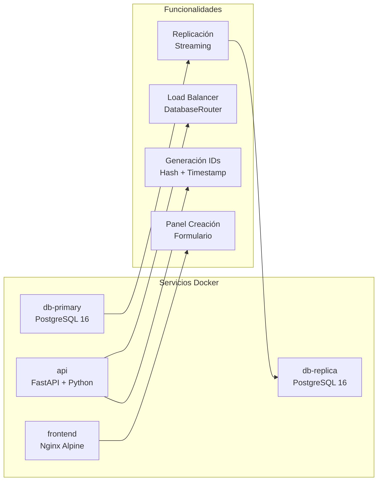
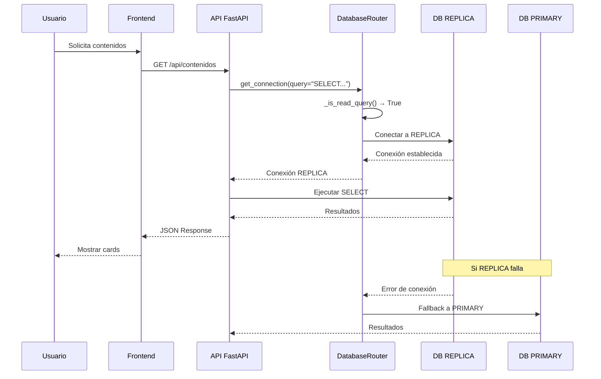
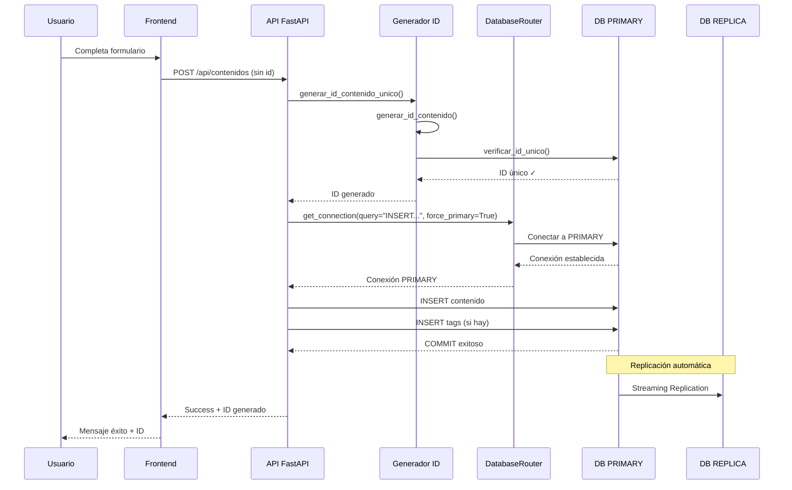
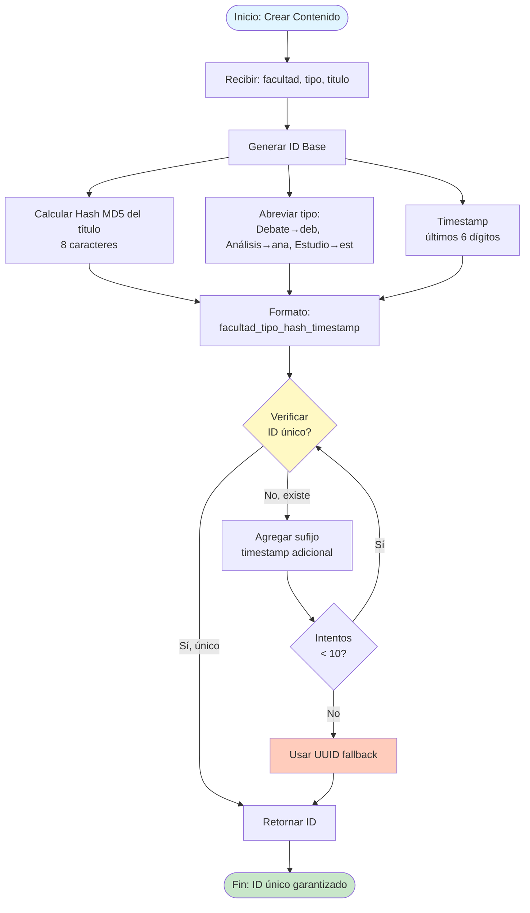
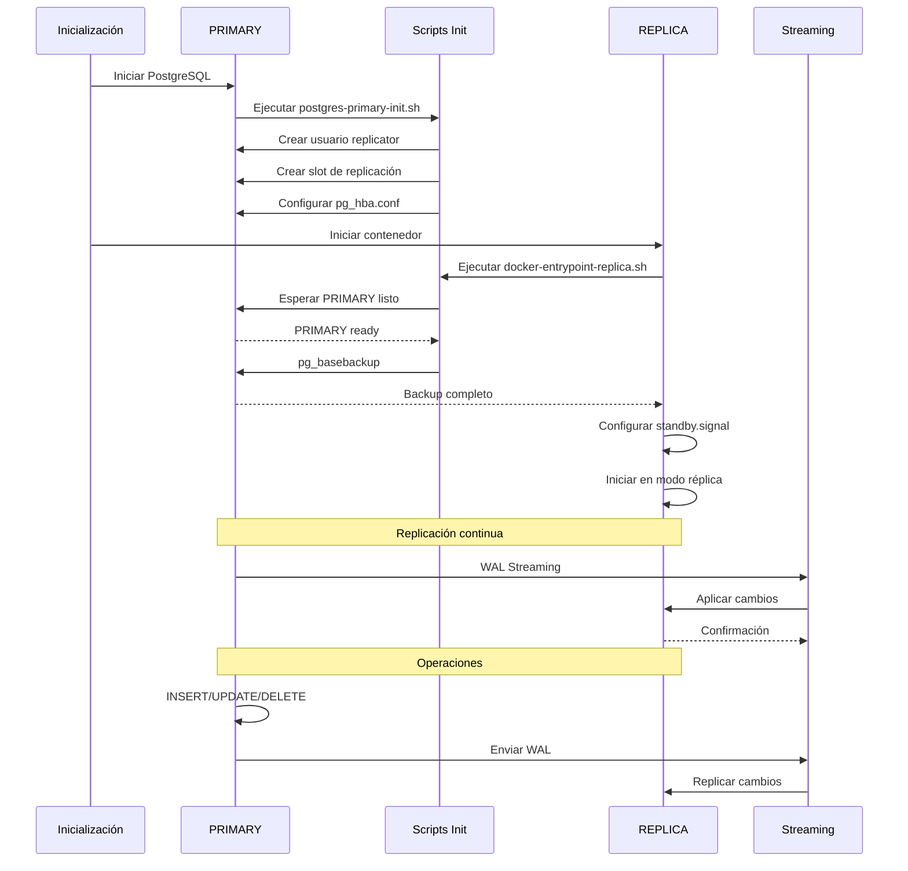
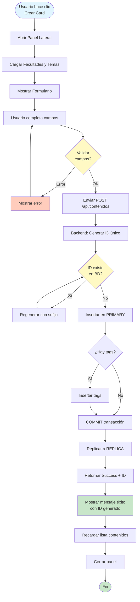
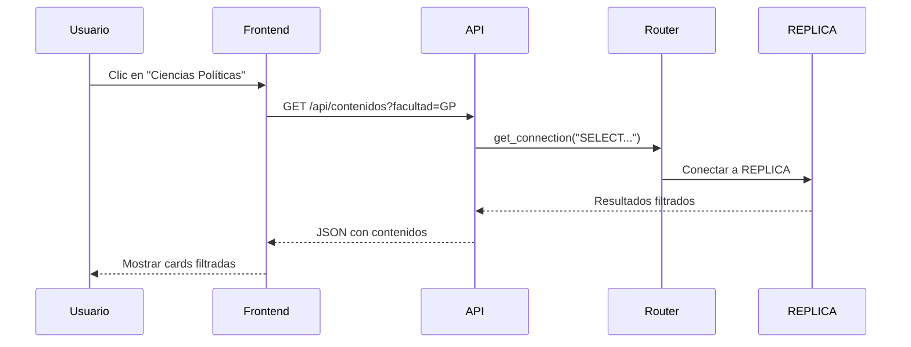
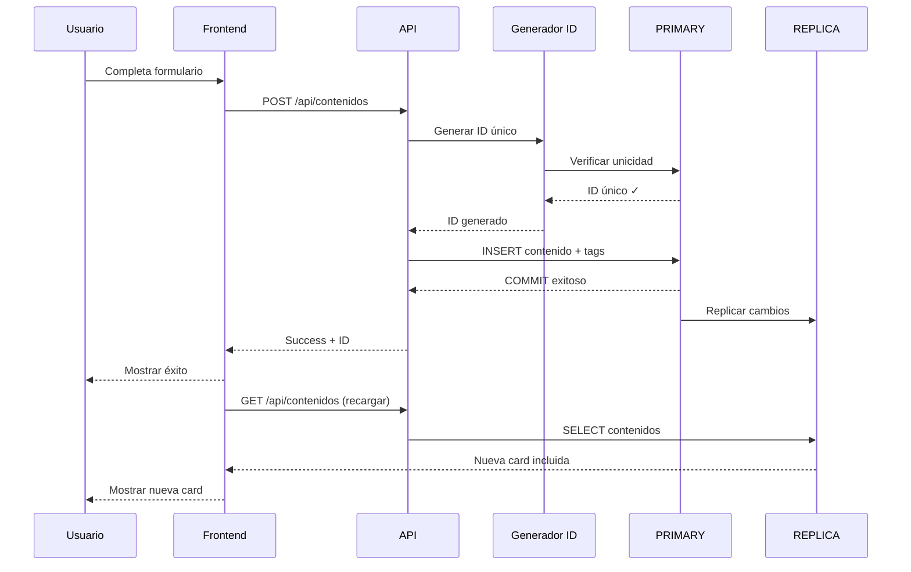
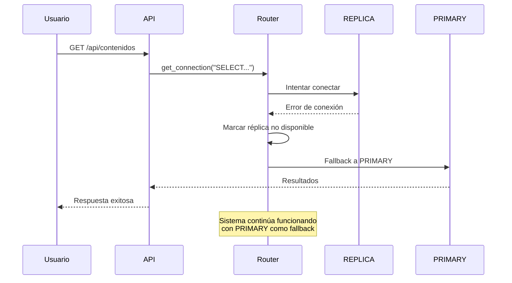
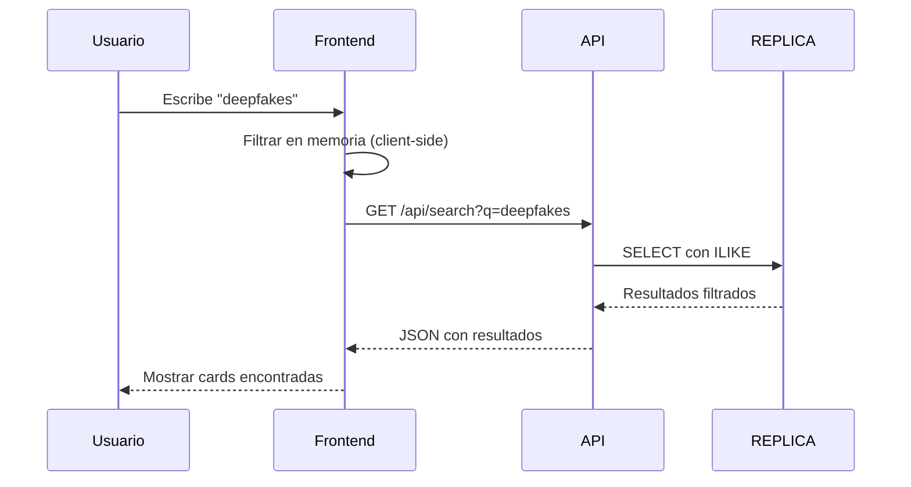

# Research Portal - Plataforma Interactiva de Investigación

Sistema completo de gestión de contenidos de investigación con arquitectura de alta disponibilidad, load balancer automático y replicación de base de datos PostgreSQL.

## 📋 Tabla de Contenidos

- [Descripción](#-descripción)
- [Arquitectura del Sistema](#-arquitectura-del-sistema)
- [Características Principales](#-características-principales)
- [Flujos del Sistema](#-flujos-del-sistema)
- [Instalación y Configuración](#-instalación-y-configuración)
- [Uso del Sistema](#-uso-del-sistema)
- [API Endpoints](#-api-endpoints)
- [Estructura del Proyecto](#-estructura-del-proyecto)
- [Monitoreo y Logs](#-monitoreo-y-logs)
- [Troubleshooting](#-troubleshooting)

---

## 🎯 Descripción

Research Portal es una plataforma web para gestionar y visualizar contenidos de investigación académica organizados por facultades y temas. El sistema implementa:

- **Load Balancer Automático**: Routing inteligente de consultas SQL
- **Replicación PostgreSQL**: Base de datos PRIMARY para escritura y REPLICA para lectura
- **Generación Automática de IDs**: Sistema robusto para garantizar integridad de datos
- **Panel de Creación**: Interfaz intuitiva para crear nuevos contenidos
- **Búsqueda y Filtrado**: Sistema de búsqueda avanzada por facultad y tema

---

## 🏗️ Arquitectura del Sistema

### Diagrama de Arquitectura General

```mermaid
graph TB
    subgraph "Cliente"
        Browser[🌐 Navegador Web]
    end
    
    subgraph "Frontend Layer"
        Nginx[📄 Nginx<br/>Puerto 80]
    end
    
    subgraph "API Layer"
        FastAPI[🚀 FastAPI<br/>Puerto 8000<br/>DatabaseRouter]
    end
    
    subgraph "Database Layer"
        Primary[(🗄️ PostgreSQL PRIMARY<br/>Puerto 5432<br/>Escritura)]
        Replica[(📋 PostgreSQL REPLICA<br/>Puerto 5433<br/>Lectura)]
    end
    
    subgraph "Network"
        Network[🔗 research_network<br/>Bridge Network]
    end
    
    Browser -->|HTTP| Nginx
    Nginx -->|Proxy /api/*| FastAPI
    FastAPI -->|SELECT Queries| Replica
    FastAPI -->|INSERT/UPDATE/DELETE| Primary
    Primary -.->|Streaming Replication| Replica
    
    Nginx -.-> Network
    FastAPI -.-> Network
    Primary -.-> Network
    Replica -.-> Network
```

### Componentes del Sistema



---

## ✨ Características Principales

### 1. Load Balancer Automático

El sistema implementa un `DatabaseRouter` que enruta automáticamente las consultas:

- **Lecturas (SELECT)** → Base de datos REPLICA
- **Escrituras (INSERT/UPDATE/DELETE)** → Base de datos PRIMARY
- **Fallback automático** → Si REPLICA no está disponible, usa PRIMARY

### 2. Replicación PostgreSQL

- **Streaming Replication**: Sincronización en tiempo real
- **Hot Standby**: Réplica en modo lectura activa
- **Slots de Replicación**: Garantiza que no se pierdan datos
- **Configuración Automática**: Scripts de inicialización incluidos

### 3. Generación Automática de IDs

- **Algoritmo robusto**: Hash MD5 + Timestamp + Facultad + Tipo
- **Verificación de unicidad**: Consulta a BD antes de insertar
- **Reintentos automáticos**: Hasta 10 intentos con sufijos diferentes
- **Fallback UUID**: Si falla, usa UUID como respaldo

### 4. Panel de Creación de Cards

- **Formulario completo**: Todos los campos de la base de datos
- **Validación frontend**: Validación HTML5 en tiempo real
- **Feedback visual**: Mensajes de éxito/error claros
- **Sin autenticación**: Acceso libre (como se solicitó)

---

## 🔄 Flujos del Sistema

### Flujo de Lectura (SELECT)



### Flujo de Escritura (INSERT)



### Flujo de Generación de ID Único



### Flujo de Replicación PostgreSQL



### Flujo Completo de Creación de Card



---

## 🚀 Instalación y Configuración

### Requisitos Previos

- Docker Desktop (Windows/Mac) o Docker Engine (Linux)
- Docker Compose v2.0+
- Git (opcional, para clonar el repositorio)

### Pasos de Instalación

#### 1. Clonar o Descargar el Proyecto

```bash
git clone <repository-url>
cd research_portal
```

#### 2. Configurar Variables de Entorno

```bash
# Copiar plantilla
cp .env.example .env

# Editar .env con tus valores (opcional, valores por defecto funcionan)
notepad .env  # Windows
nano .env     # Linux/Mac
```

**Variables importantes**:
- `DB_PRIMARY_PASSWORD`: Contraseña de PRIMARY (cambiar en producción)
- `DB_REPLICA_PASSWORD`: Contraseña de REPLICA (cambiar en producción)
- `POSTGRES_REPLICATION_PASSWORD`: Contraseña de replicación (cambiar en producción)

#### 3. Iniciar los Servicios

```bash
# Construir e iniciar todos los servicios
docker-compose up -d

# Ver logs en tiempo real
docker-compose logs -f

# Verificar estado
docker-compose ps
```

#### 4. Verificar Instalación

```bash
# Verificar health de la API
curl http://localhost:8000/api/health

# Debería retornar:
# {
#   "status": "healthy",
#   "primary": "connected",
#   "replica": "connected"
# }
```

### Tiempos de Inicialización

- **PRIMARY**: ~10-15 segundos
- **REPLICA**: ~30-60 segundos (primera vez, hace backup completo)
- **API**: ~5-10 segundos
- **Frontend**: ~3-5 segundos

---

## 📖 Uso del Sistema

### Acceso al Sistema

1. **Frontend**: Abrir navegador en `http://localhost`
2. **API**: `http://localhost:8000`
3. **API Docs**: `http://localhost:8000/docs` (Swagger UI)

### Crear una Nueva Card

1. Hacer clic en el botón **"Crear Card"** en el header
2. Completar el formulario:
   - **Facultad**: Seleccionar de la lista
   - **Tema**: Seleccionar de la lista
   - **Tipo**: Debate, Análisis o Estudio
   - **Título**: Título del contenido (máx. 255 caracteres)
   - **Resumen**: Descripción del contenido
   - **Campos opcionales**: Emoción, fuente, URLs, tags
3. Hacer clic en **"Crear Card"**
4. El sistema generará automáticamente un ID único
5. Verás el ID generado en el mensaje de éxito

### Buscar y Filtrar

- **Por Facultad**: Clic en una facultad en el sidebar
- **Búsqueda de texto**: Escribir en el campo de búsqueda del header
- **Ver detalles**: Clic en cualquier card para ver información completa

---

## 🔌 API Endpoints

### GET `/api/facultades`

Obtiene todas las facultades disponibles.

**Routing**: REPLICA (lectura)

**Response**:
```json
{
  "success": true,
  "data": [
    {
      "id_facultad": "GP",
      "nombre": "Ciencias Políticas y RR.II.",
      "color_hex": "#3B82F6"
    }
  ]
}
```

### GET `/api/temas`

Obtiene todos los temas disponibles.

**Routing**: REPLICA (lectura)

**Response**:
```json
{
  "success": true,
  "data": [
    {
      "id_tema": "gp_deepfakes_electorales",
      "nombre": "Deepfakes Electorales y Desinformación",
      "descripcion": "Análisis de la nueva geopolítica..."
    }
  ]
}
```

### GET `/api/contenidos`

Obtiene todos los contenidos, con filtros opcionales.

**Routing**: REPLICA (lectura)

**Query Parameters**:
- `facultad` (opcional): Filtrar por ID de facultad
- `search` (opcional): Búsqueda de texto

**Ejemplo**:
```
GET /api/contenidos?facultad=GP&search=deepfakes
```

**Response**:
```json
{
  "success": true,
  "data": [
    {
      "id_contenido": "gp_deb_a1b2c3d4_123456",
      "id_tema": "gp_deepfakes_electorales",
      "id_facultad": "GP",
      "tipo": "Debate",
      "titulo": "¿Sobrevivirá la democracia...",
      "resumen": "Análisis de la nueva geopolítica...",
      "facultad_nombre": "Ciencias Políticas y RR.II.",
      "color_hex": "#3B82F6",
      "tema_nombre": "Deepfakes Electorales..."
    }
  ]
}
```

### GET `/api/contenidos/{id_contenido}`

Obtiene detalles completos de un contenido específico.

**Routing**: REPLICA (lectura)

**Response**:
```json
{
  "success": true,
  "data": {
    "id_contenido": "gp_deb_a1b2c3d4_123456",
    "titulo": "...",
    "resumen": "...",
    "tags": ["tag1", "tag2"],
    "key_concepts": ["concepto1"],
    "main_actors": ["actor1"],
    "case_studies": ["caso1"],
    "future_trends": ["tendencia1"]
  }
}
```

### POST `/api/contenidos`

Crea un nuevo contenido.

**Routing**: PRIMARY (escritura)

**Request Body**:
```json
{
  "id_tema": "gp_deepfakes_electorales",
  "id_facultad": "GP",
  "tipo": "Debate",
  "titulo": "Nuevo tema de debate",
  "resumen": "Descripción del contenido...",
  "emocion_dominante": "Preocupación",
  "emocion_intensidad": 0.75,
  "tipo_fuente": "paper",
  "origen_fuente": "paper_academico",
  "url_ver": "https://ejemplo.com/articulo",
  "url_descargar": null,
  "tags": ["tag1", "tag2", "tag3"]
}
```

**Response**:
```json
{
  "success": true,
  "message": "Contenido creado exitosamente",
  "id_contenido": "gp_deb_a1b2c3d4_123456"
}
```

**Nota**: El `id_contenido` se genera automáticamente y se retorna en la respuesta.

### GET `/api/search?q={query}`

Búsqueda de contenidos por término.

**Routing**: REPLICA (lectura)

**Response**: Similar a `/api/contenidos`

### GET `/api/health`

Verifica el estado del sistema y las conexiones a las bases de datos.

**Response**:
```json
{
  "status": "healthy",
  "primary": "connected",
  "replica": "connected"
}
```

---

## 📁 Estructura del Proyecto

```
research_portal/
├── 📄 docker-compose.yml          # Orquestación de servicios Docker
├── 🐳 Dockerfile                  # Imagen de la API (FastAPI)
├── 🐍 app.py                      # API Backend con DatabaseRouter
├── 🌐 index.html                  # Frontend (HTML + JavaScript)
├── ⚙️ nginx.conf                  # Configuración de Nginx
├── 🗄️ init.sql                    # Script de inicialización de BD
├── 📦 requirements.txt            # Dependencias Python
├── 🔒 .env.example                # Plantilla de variables de entorno
├── 🚫 .gitignore                  # Archivos a ignorar en Git
│
├── 📂 scripts/
│   ├── postgres-primary-init.sh          # Configuración PRIMARY
│   ├── configure-pg-hba.sh              # Configuración pg_hba.conf
│   ├── docker-entrypoint-replica.sh     # Entrypoint para REPLICA
│   └── postgres-replica-init.sh         # Script auxiliar
│
└── 📚 Documentación/
    ├── README.md                  # Este archivo
    ├── ENV_VARIABLES.md           # Documentación de variables
    ├── FEATURE_CREAR_CARD.md      # Documentación del panel de creación
    ├── README_LOAD_BALANCER.md    # Documentación del load balancer
    ├── VER_LOGS.md                # Guía de logs
    ├── VERIFICACION_ID_GENERATION.md  # Verificación de generación de IDs
    ├── SOLUCION_PROBLEMAS.md      # Solución de problemas comunes
    └── IMPLEMENTACION.md          # Resumen de implementación
```

### Descripción de Archivos Clave

#### `app.py`
- Clase `DatabaseRouter`: Enruta consultas a PRIMARY/REPLICA
- Funciones de generación de IDs: `generar_id_contenido_unico()`
- Endpoints FastAPI: Todos los endpoints de la API
- Logging: Sistema de logs detallado

#### `docker-compose.yml`
- Servicios: db-primary, db-replica, api, frontend
- Redes: research_network (bridge)
- Volúmenes: postgres_primary_data, postgres_replica_data
- Healthchecks: Para todos los servicios

#### `index.html`
- Frontend completo con Tailwind CSS
- Panel lateral para crear cards
- Búsqueda y filtrado
- Modal de detalles

---

## 📊 Monitoreo y Logs

### Ver Logs en Tiempo Real

```bash
# Todos los servicios
docker-compose logs -f

# Solo API
docker-compose logs -f api

# Solo PRIMARY
docker-compose logs -f db-primary

# Solo REPLICA
docker-compose logs -f db-replica
```

### Logs de Creación de Cards

Cuando se crea una card, verás en los logs:

```
================================================================================
📝 NUEVA SOLICITUD DE CREACIÓN DE CONTENIDO
================================================================================
📚 Facultad: GP
🎯 Tema: gp_deepfakes_electorales
📋 Tipo: Debate
📌 Título: Nuevo tema de debate
📄 Resumen: Descripción del nuevo contenido...
🔑 Generando ID único para el contenido...
✅ ID generado: gp_deb_a1b2c3d4_123456
💾 Conectando a PRIMARY database para escritura...
✅ Conexión establecida con PRIMARY database
📥 Insertando contenido principal...
✅ Contenido insertado exitosamente. ID: gp_deb_a1b2c3d4_123456
🏷️ Insertando 3 tag(s)...
   ✓ Tag insertado: 'tag1'
   ✓ Tag insertado: 'tag2'
   ✓ Tag insertado: 'tag3'
✅ 3 tag(s) insertado(s) exitosamente
💾 Cambios confirmados (COMMIT) en PRIMARY database
================================================================================
✨ CONTENIDO CREADO EXITOSAMENTE: gp_deb_a1b2c3d4_123456
================================================================================
```

### Verificar Estado de Replicación

```bash
# Conectarse a PRIMARY
docker exec -it research_db_primary psql -U postgres_user -d synthetic_data_db

# Ver slots de replicación
SELECT * FROM pg_replication_slots;

# Ver estadísticas de replicación
SELECT * FROM pg_stat_replication;

# Conectarse a REPLICA
docker exec -it research_db_replica psql -U postgres_user -d synthetic_data_db

# Verificar que está en modo réplica
SELECT pg_is_in_recovery();

# Ver retraso de replicación
SELECT pg_last_wal_replay_lag();
```

### Healthchecks

Todos los servicios tienen healthchecks configurados:

- **db-primary**: `pg_isready` cada 10s
- **db-replica**: `pg_isready` cada 10s
- **api**: `curl /api/health` cada 10s
- **frontend**: `wget` cada 10s

Ver estado:
```bash
docker-compose ps
```

---

## 🔧 Troubleshooting

### Problema: La réplica no se conecta

**Síntomas**: `db-replica` muestra "unhealthy" o errores de conexión

**Solución**:
```bash
# Ver logs de la réplica
docker-compose logs db-replica

# Verificar que PRIMARY esté corriendo
docker-compose ps db-primary

# Recrear la réplica
docker-compose stop db-replica
docker volume rm research_portal_postgres_replica_data
docker-compose up -d db-replica
```

### Problema: La API usa PRIMARY para todo

**Causa**: La réplica no está disponible

**Verificación**:
```bash
# Ver logs de la API
docker-compose logs api | grep "réplica\|replica"

# Verificar health
curl http://localhost:8000/api/health
```

**Solución**: Verificar que `db-replica` esté corriendo y saludable

### Problema: Error al crear card - ID duplicado

**Causa**: Colisión muy rara en generación de ID

**Solución**: El sistema automáticamente:
1. Detecta la colisión
2. Regenera con sufijo adicional
3. Reintenta hasta 10 veces
4. Usa UUID como fallback si es necesario

### Problema: Frontend muestra "unhealthy"

**Nota**: Esto es normal. El healthcheck del frontend puede fallar ocasionalmente, pero el servicio funciona correctamente.

**Verificación**:
```bash
# Probar acceso directo
curl http://localhost
```

### Problema: No se ven los cambios después de crear una card

**Solución**:
1. Verificar que el contenido se insertó en PRIMARY
2. Verificar que la réplica esté sincronizada
3. Recargar la página (F5)
4. Verificar logs de la API

---

## 🎯 Casos de Uso

### Caso 1: Usuario busca contenidos por facultad



### Caso 2: Usuario crea una nueva card



### Caso 3: Réplica no disponible (Fallback)



### Caso 4: Búsqueda de texto



---

## 🔐 Seguridad

### Variables de Entorno

⚠️ **IMPORTANTE**: Cambiar todas las contraseñas por defecto en producción:

```bash
# En .env
DB_PRIMARY_PASSWORD=tu_contraseña_segura_aqui
DB_REPLICA_PASSWORD=tu_contraseña_segura_aqui
POSTGRES_REPLICATION_PASSWORD=tu_contraseña_replicacion_aqui
```

### Red Interna

- Todos los servicios están en la red interna `research_network`
- Solo los puertos necesarios están expuestos al host
- La comunicación entre servicios es privada

### Sin Autenticación

⚠️ **Nota**: El sistema actualmente no tiene autenticación/autorización. Cualquier usuario puede crear contenidos. Para producción, se recomienda agregar:

- Autenticación de usuarios
- Control de acceso basado en roles
- Rate limiting
- Validación de entrada más estricta

---

## 📈 Próximas Mejoras

- [ ] Sistema de autenticación y autorización
- [ ] Edición de cards existentes
- [ ] Eliminación de cards
- [ ] Múltiples réplicas para mayor escalabilidad
- [ ] Cache con Redis para lecturas frecuentes
- [ ] Métricas y monitoreo (Prometheus/Grafana)
- [ ] Backup automático de base de datos
- [ ] API versioning
- [ ] Documentación OpenAPI/Swagger mejorada
- [ ] Tests automatizados

---

## 📝 Licencia

Este proyecto es de uso educativo/académico.

---

## 👥 Contribuciones

Para contribuir al proyecto:

1. Fork el repositorio
2. Crea una rama para tu feature (`git checkout -b feature/nueva-funcionalidad`)
3. Commit tus cambios (`git commit -m 'Agregar nueva funcionalidad'`)
4. Push a la rama (`git push origin feature/nueva-funcionalidad`)
5. Abre un Pull Request

---

## 📞 Soporte

Para problemas o preguntas:

1. Revisa la documentación en `/docs`
2. Consulta `SOLUCION_PROBLEMAS.md`
3. Revisa los logs: `docker-compose logs -f`
4. Verifica el estado: `docker-compose ps`

---

**Desarrollado con ❤️ para la gestión de contenidos de investigación**

# Docker-proyecto

